***
# <h1 align="center"> 💥Primeros Programas en Java💥 </h1>
***

<p align="center">
<br>
</p>

<p align="center">
<br>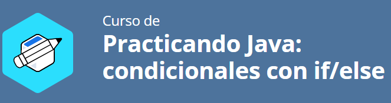
</p>

## 📄Descripción del proyecto

```sh

Este repositorio contiene una colección de programas sencillos desarrollados en Java utilizando los 
fundamentos de la Programación Orientada a Objetos (POO). Está pensado como un punto de partida para 
estudiantes o autodidactas que estén dando sus primeros pasos en el paradigma orientado a objetos 
con el lenguaje Java.

```

## 🛠️Recursos y herramientas utilizados

```sh

- Trello: para organizar las tareas y el progreso del proyecto.
- Discord: para comunicarse con los compañeros y aclarar dudas.
- Cursos y formaciones de Alura Latam: para consultar contenidos relevantes y obtener más información.
- GitHub: para publicar y compartir el código del proyecto.
- LinkedIn: para conectarse con la comunidad y mostrar el aprendizaje adquirido.

```

## 🧱Tecnologías Utilizadas

✔️☕ Oracle Java OpenJDK 21.0.6

✔️🛠️ IntelliJ IDEA 2025 1.1.1

## 🔆Resultados de la Aplicación Bancaria

>> 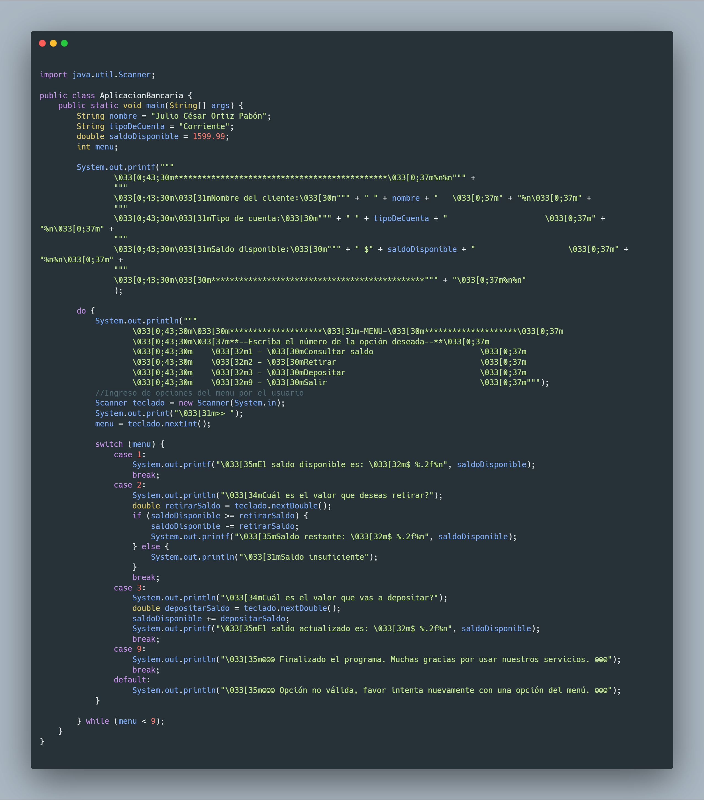

>> 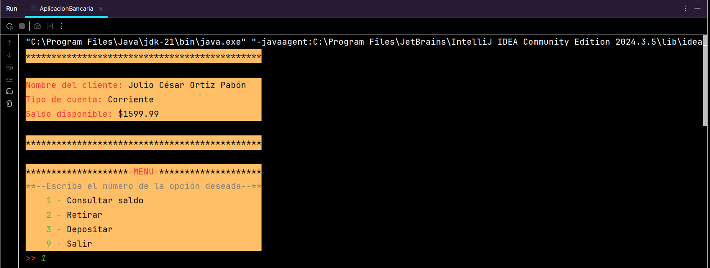

>> 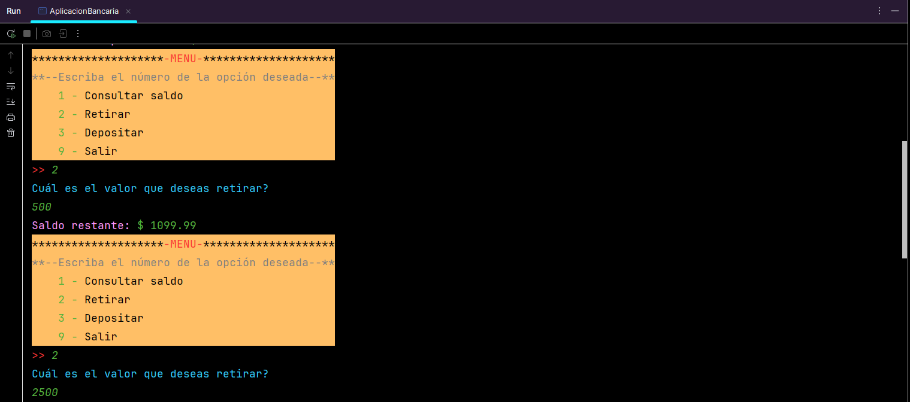

>> 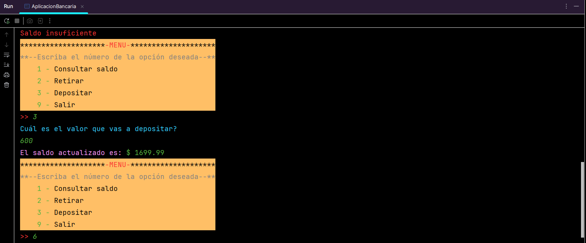

>> 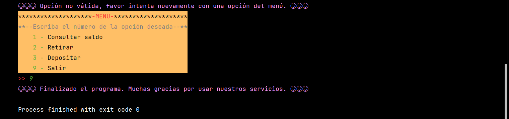

## 🔆Resultados del Juego de Adivinanzas

>> 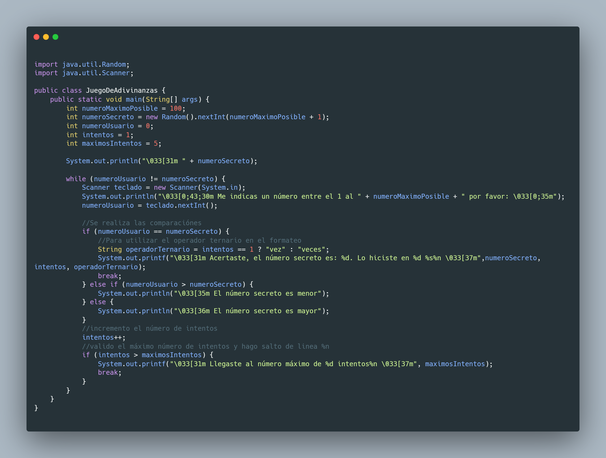

>> 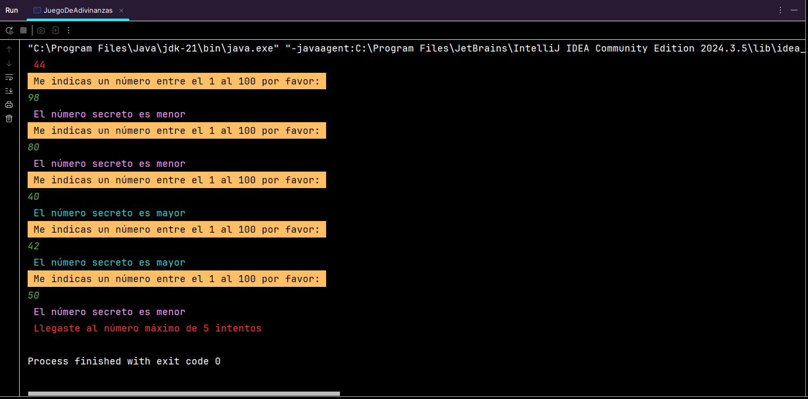

>> 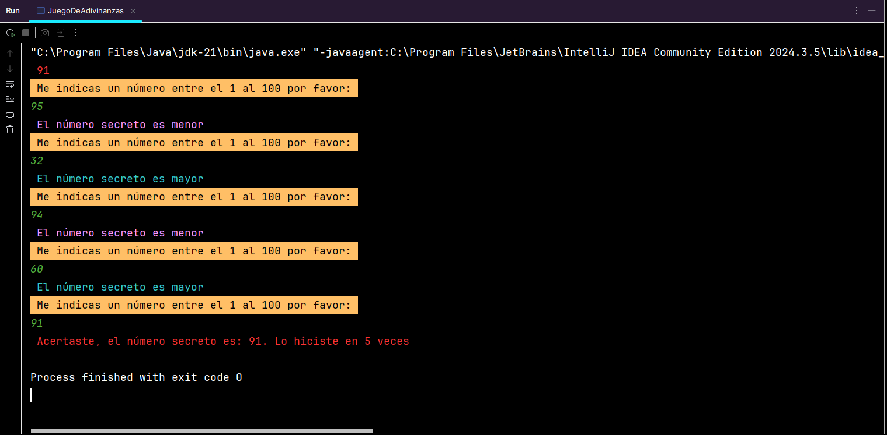

## 🔆Resultados de Número Par e Impar

>> 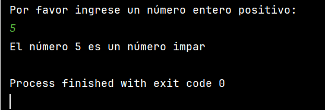

>> 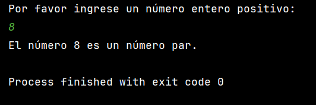

## 🔆Resultados de Comparar Dos Números

>> 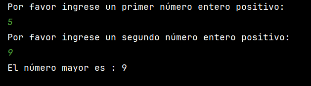

## 🔆Resultados de Evaluación de Estudiante

>> 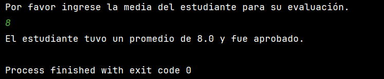

>> 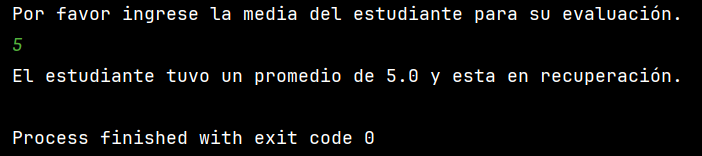

## 🔆Resultados de Validación Password

>> 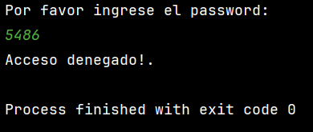

>> 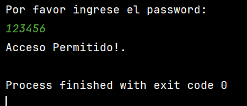

## 🔆Resultados de Verificación Descuento en Compras

>> 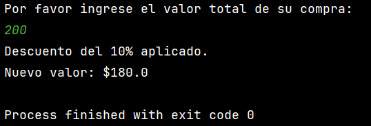

## 🔆Resultados de Verificación día Hábil

>> 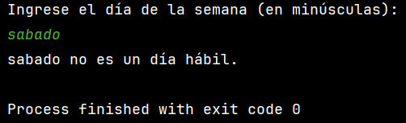

>> 

## 🔆Resultados de Verificación Acceso y Permiso

>> 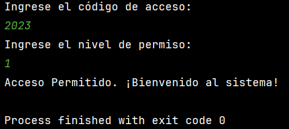

>> 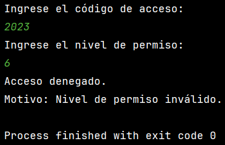

## 🔆Resultados de Verificación para Donar Sangre

>> 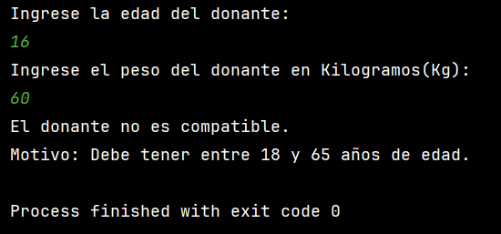

>> 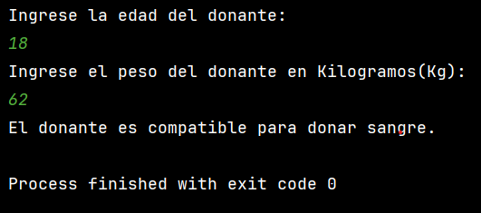

## 🔆Resultados de Verificación Si es Triangulo

>> 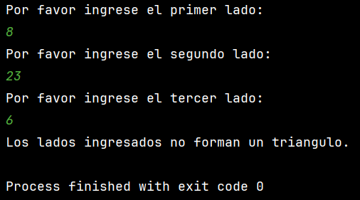

## 🔆Resultados de Verificando Prestamo en un Intervalo

>> 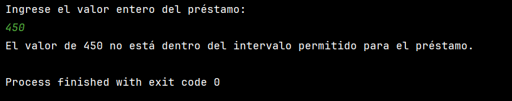

>> 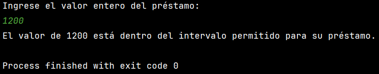

## 👩👨Autores del Proyecto

>>     Programación Java POO, diagrama UML
>                               
>>>   Desafio puesto

## 📜Certificados

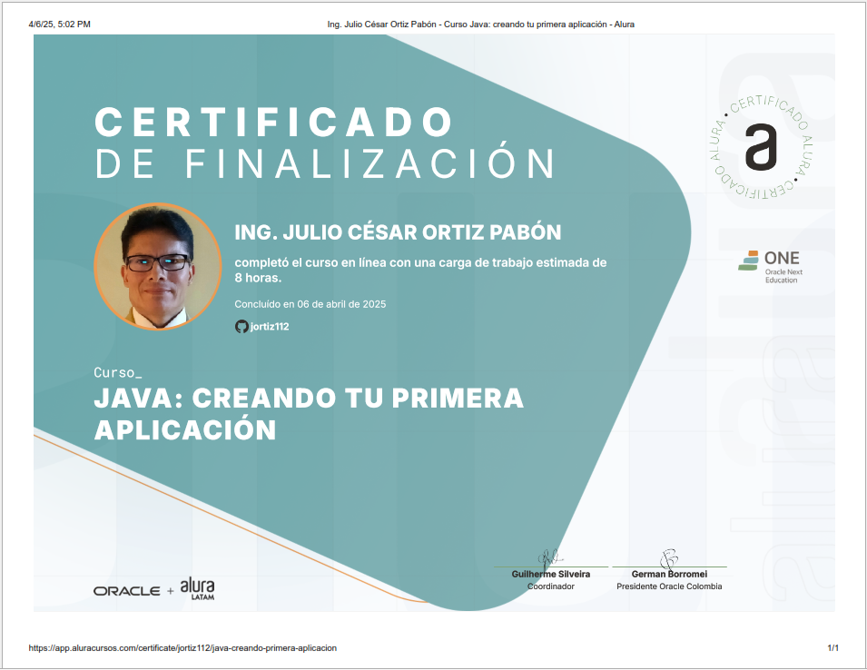

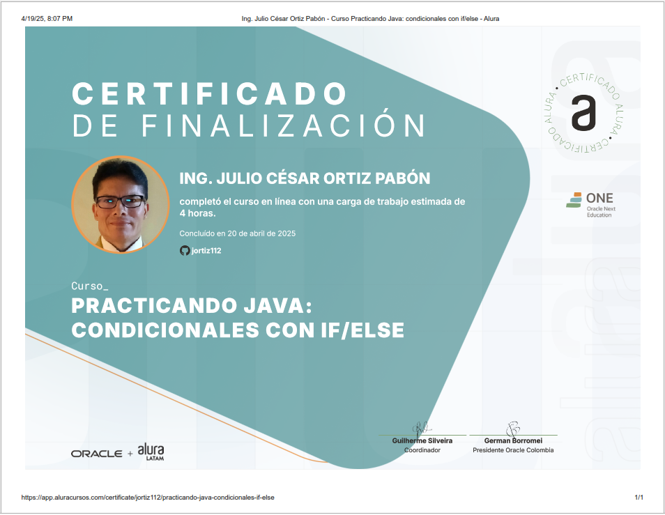
